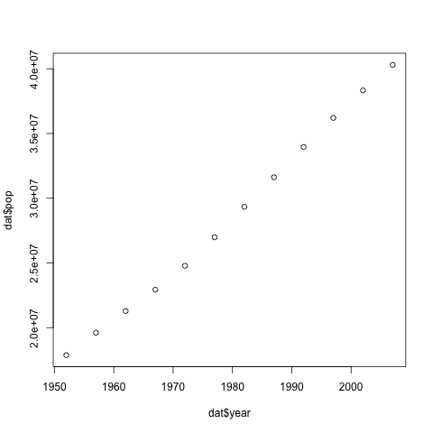

> ## Learning Objectives {.objectives}
> * Read tabular data from a file into a program.
> * Select individual values and subsections from data.
> * Perform operations on a data frame of data.
> * Display simple graphs.

We are studying the changes in total population, life expectancy and gross national income per capita (US $ by exchange rate) for 142 countries over a period of 55 years with measurements taken every 5 year, from 1952 to 2207. The data sets are stored in [comma-separated values](reference.html#comma-separated-values-(csv)) (CSV) format. Each row holds the observations for a country at one time point. The columns hold the following information: country, year, total population, continent,  life expectancy and gross national income per capita. For more information visit the [Gapminder website](http://www.gapminder.org/data/documentation/).

The first few rows of our first file look like this:

~~~{.output}
country,year,pop,continent,lifeExp,gdpPercap
Afghanistan,1952,8425333,Asia,28.801,779.4453145
Afghanistan,1957,9240934,Asia,30.332,820.8530296
Afghanistan,1962,10267083,Asia,31.997,853.10071
Afghanistan,1967,11537966,Asia,34.02,836.1971382
Afghanistan,1972,13079460,Asia,36.088,739.9811058
Afghanistan,1977,14880372,Asia,38.438,786.11336
Afghanistan,1982,12881816,Asia,39.854,978.0114388
Afghanistan,1987,13867957,Asia,40.822,852.3959448
Afghanistan,1992,16317921,Asia,41.674,649.3413952

~~~

We want to:

* Load data into memory,
* Calculate the average value of total population per year across all countries, and
* Plot the results.

### Loading Data

To load our gapminder data, first we need to tell our computer where is the file that contains the values. We know its name is `gapminder-FiveYearData.csv`. This is very important in R, if we forget this step we'll get an error message when trying to read. We can change the current working directory using the function `setwd`. For this example, we change the path to the working directory where our project is stored that is named `test_project`:

~~~{.r}
setwd("~/test_project")
~~~

Alternatively you can change the working directory using the RStudio GUI using the menu option `Session` -> `Set Working Directory` -> `Choose Directory...`

We also know that experimental files are located in the directory `data` inside the working directory. Now we can load the data into R using `read.csv`:

~~~{.r}
read.csv(file = "data/gapminder-FiveYearData.csv", header = TRUE)
~~~

The expression `read.csv(...)` is a [function call](reference.html#function-call) that asks R to run the function `read.csv`.

`read.csv` has two [arguments](reference.html#argument): the name of the file we want to read, and whether the first line of the file contains names for the columns of data.
The filename needs to be a character string (or [string](reference.html#string) for short), so we put it in quotes. Assigning the second argument, `header`, to be `TRUE` indicates that the data file has column headers.

> ## Tip {.callout}
>
> `read.csv` is a fairly thin wrapper around `read.table`, a more general 
> R function to read data. `read.csv` is a function specific for comma 
> separated data.
> 
> Another file format you might encounter is the tab-separated. To read such 
> files, use `read.delim` and specify a tab as a separator using `sep="\t"`.
>
> You can also read in files from the Internet by replacing
> the file paths with a web address.
>
> Finally, you can also read directly from excel spreadsheets without
> converting them to plain text first by using the `xlsx` package.
>

Since we didn't tell it to do anything else with the function's output, the console will display the full contents of the file `gapminder-FiveYearData.csv`.

> #### Challenge 1 {.challenge}
>
> Go to file -> new file -> R script, and write an R script to
> read the gapminder dataset and assign it to a variable named `gapminder` . 
> 
> Create a new folder in your project named `scripts/`, store the R script
> under it and add it to version control.
>
> Run the script using the `source` function, using the file path
> as its argument (or by pressing the "source" button in RStudio).
>
> What is the data structure of `gapminder`? (hint: use function `class`)
>

Data frames are similar to matrices, except each column can be a different atomic type. Underneath the hood, data frames are really lists, where each element is an atomic vector, with the added restriction that they're all the same length. Data frames are very useful for storing data and you will find them elsewhere when programming in R. A typical data frame of experimental data contains individual observations in rows and variables in columns.

We can see the dimensions, or [shape](reference.html#shape-(of-an-array)), of the data frame with the function `dim`:

~~~{.r}
dim(gapminder)
~~~

~~~{.output}
[1] 1705    6

~~~

This tells us that our data frame, `dat`, has 1705 rows and 6 columns. Alternatively, you can see the number of rows and columns using the functions `nrow` and `ncol`, respectively.

### Slicing data using indices

If we want to get a single value from the data frame, we can provide an [index](reference.html#index) in square brackets, just as we do in math:

~~~{.r}
# first value in dat
gapminder[1, 1]
~~~

~~~{.output}
[1] Afghanistan
142 Levels: Afghanistan Albania Algeria Angola Argentina Australia ... Zimbabwe

~~~

R automatically stored this first column as a factor, not a character vector.
We can change this:

~~~{.r}
gapminder$country <- as.character(gapminder$country)
class(gapminder$country)
~~~

~~~{.output}
[1] "character"

~~~

An index like `[1, 1]` selects a single element of a data frame, but we can select whole sections as well. For example, we can select the first five measurements (rows) like this:

~~~{.r}
gapminder[1:5, ]
~~~

~~~{.output}
      country year      pop continent lifeExp gdpPercap
1 Afghanistan 1952  8425333      Asia  28.801  779.4453
2 Afghanistan 1957  9240934      Asia  30.332  820.8530
3 Afghanistan 1962 10267083      Asia  31.997  853.1007
4 Afghanistan 1967 11537966      Asia  34.020  836.1971
5 Afghanistan 1972 13079460      Asia  36.088  739.9811
~~~

The [slice](reference.html#slice) `1:5` means, "Start at index 1 and go to index 5". To select all the columns you simply don't include a slice for the those and R returns them all. If we don't provide a slice for either rows or columns, e.g. `dat[, ]`, R returns the full data frame.

The slice does not need to start at 1, e.g. the line below selects rows 5 through 10:

~~~{.r}
gapminder[5:10, ]
~~~

We can use the function `c` to select non-contiguous values using both indices(for the rows) and names (for the columns):

~~~{.r}
gapminder[c(3, 8, 37, 56), c("country", "year", "pop")]
~~~

~~~{.output}
       country year      pop
3  Afghanistan 1962 10267083
8  Afghanistan 1987 13867957
37      Angola 1952  4232095
56   Argentina 1987 31620918

~~~

### Conditional slicing of data

To extract all the measurements for *Argentina*, we use conditional slicing:

~~~{.r}
gapminder[gapminder$country == "Argentina", ]
~~~

~~~{.output}
     country year      pop continent lifeExp gdpPercap
49 Argentina 1952 17876956  Americas  62.485  5911.315
50 Argentina 1957 19610538  Americas  64.399  6856.856
51 Argentina 1962 21283783  Americas  65.142  7133.166
52 Argentina 1967 22934225  Americas  65.634  8052.953
53 Argentina 1972 24779799  Americas  67.065  9443.039
54 Argentina 1977 26983828  Americas  68.481 10079.027
55 Argentina 1982 29341374  Americas  69.942  8997.897
56 Argentina 1987 31620918  Americas  70.774  9139.671
57 Argentina 1992 33958947  Americas  71.868  9308.419
58 Argentina 1997 36203463  Americas  73.275 10967.282
59 Argentina 2002 38331121  Americas  74.340  8797.641
60 Argentina 2007 40301927  Americas  75.320 12779.380

~~~

The condition operator is applied to every element of `country` column of the `gapminder` data frame, only to return those rows of `gapminder` for which the
country is "Argentina".

> #### Challenge 2 {.challenge}
>
> Find which country(-ies) had the highest `gdpPercap` throughout all years.
>
> Discuss with your neighbors. Have you come up with the same answer? Have you > used the same command(s)?
>

### Plotting

The mathematician Richard Hamming once said, "The purpose of computing is insight, not numbers," and the best way to develop insight is often to visualize data.
Visualisation deserves an entire lecture (or course) of its own, but we can explore a few of R's plotting features.

Let's take a look at the population of Argentina over time.
Plotting the values is done with the function `plot`.

~~~{.r}
dat <- gapminder[gapminder$country=="Argentina", ]
plot(dat$year, dat$pop)
~~~

Above, we gave the function `plot` a vector of numbers corresponding to the population of Argentina over the years and the years. `plot` created a scatter plot where the y-axis is the population and the x-axis are the years.

<!---
## Challenge Solutions

> #### Solution to challenge 1 {.challenge}
>
> Create a data frame that holds the following information for yourself:
>
> * First name
> * Last name
> * Age
>
> Then use rbind to add the same information for the people sitting near you.
>
> Now use cbind to add a column of logicals answering the question,
> "Is there anything in this workshop you're finding confusing?"
>
> 
> ~~~{.r}
> my_df <- data.frame(first_name = "Software", last_name = "Carpentry", age = 17)
> my_df <- rbind(my_df, list("Jane", "Smith", 29))
> my_df <- rbind(my_df, list(c("Jo", "John"), c("White", "Lee"), c(23, 41)))
> my_df <- cbind(my_df, confused = c(FALSE, FALSE, TRUE, FALSE))
> ~~~
>

-->