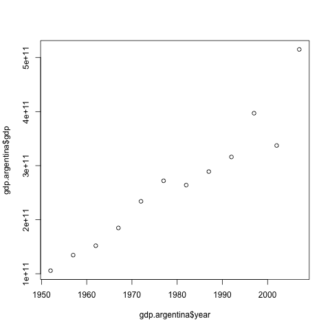

> ## Learning Objectives {.objectives}
>
> * Explain what a `for` loop does.
> * Correctly write `for` loops to repeat simple calculations.
> * Trace changes to a loop variable as the loop runs.
> * Trace changes to other variables as they are updated by a `for` loop.
> * Use a function to get a list of filenames that match a simple pattern.
> * Use a `for` loop to process multiple files.

We have created a function called `calcGDP` that calculates the Gross Domestic Product:

~~~{.r}
calcGDP <- function(dat, year=NULL, country=NULL) {
	if(!is.null(year)){
		dat <- dat[dat$year %in% year, ]
	}
	if(!is.null(country))
	{
	  dat <- dat[dat$country %in% country,]
	}

  gdp <- dat$pop * dat$gdpPercap

  new <- cbind(dat, gdp=gdp)
  return(new)
}

gdp.argentina <- calcGDP(dat=gapminder, country="Argentina")
~~~

Following the plot example in lesson [05](05-data-analysis.html) we can plot the gross domestic product of Argentina over the years:

~~~{.r}
plot(gdp.argentina$year, gdp.argentina$gdp)
~~~

but we have data for 142 countries in our dataset. We want to create plots for all of them with a single statement. To do that, we'll have to teach the computer how to repeat things.

### For Loops

Suppose we want to print each word in a sentence.
One way is to use six `print` statements:

~~~{.r}
best_practice <- c("Let", "the", "computer", "do", "the", "work")
print_words <- function(sentence) {
  print(sentence[1])
  print(sentence[2])
  print(sentence[3])
  print(sentence[4])
  print(sentence[5])
  print(sentence[6])
}

print_words(best_practice)
~~~

~~~{.output}
[1] "Let"
[1] "the"
[1] "computer"
[1] "do"
[1] "the"
[1] "work"

~~~

but that's a bad approach for two reasons:

 1. It doesn't scale: if we want to print the elements in a vector that's hundreds long, we'd be better off just typing them in.

 2. It's fragile: if we give it a longer vector, it only prints part of the data, and if we give it a shorter input, it returns `NA` values because we're asking for elements that don't exist!

~~~{.r}
best_practice[-6]
~~~

~~~{.output}
[1] "Let"      "the"      "computer" "do"       "the"     

~~~

~~~{.r}
print_words(best_practice[-6])
~~~

~~~{.output}
[1] "Let"
[1] "the"
[1] "computer"
[1] "do"
[1] "the"
[1] NA

~~~

> ## Tip {.callout}
>
> R has has a special variable, `NA`, for designating missing values that are
> **N**ot **A**vailable in a data set. See `?NA` and [An Introduction to R][na]
> for more details.

[na]: http://cran.r-project.org/doc/manuals/r-release/R-intro.html#Missing-values

Here's a better approach:

~~~{.r}
print_words <- function(sentence) {
  for (word in sentence) {
    print(word)
  }
}

print_words(best_practice)
~~~

~~~{.output}
[1] "Let"
[1] "the"
[1] "computer"
[1] "do"
[1] "the"
[1] "work"

~~~

This is shorter---certainly shorter than something that prints every character in a hundred-letter string---and more robust as well:

~~~{.r}
print_words(best_practice[-6])
~~~

~~~{.output}
[1] "Let"
[1] "the"
[1] "computer"
[1] "do"
[1] "the"

~~~

The improved version of `print_words` uses a [for loop](reference.html#for-loop) to repeat an operation---in this case, printing---once for each thing in a collection.
The general form of a loop is:

~~~{.r}
for (variable in collection) {
  do things with variable
}
~~~

We can name the [loop variable](reference.html#loop-variable) anything we like (with a few [restrictions][], e.g. the name of the variable cannot start with a digit).
`in` is part of the `for` syntax.
Note that the body of the loop is enclosed in curly braces `{ }`.
For a single-line loop body, as here, the braces aren't needed, but it is good practice to include them as we did.

[restrictions]: http://cran.r-project.org/doc/manuals/R-intro.html#R-commands_003b-case-sensitivity-etc

Here's another loop that repeatedly updates a variable:

~~~{.r}
len <- 0
vowels <- c("a", "e", "i", "o", "u")
for (v in vowels) {
  len <- len + 1
}
# Number of vowels
len
~~~

~~~{.output}
[1] 5

~~~

It's worth tracing the execution of this little program step by step.
Since there are five elements in the vector `vowels`, the statement inside the loop will be executed five times.
The first time around, `len` is zero (the value assigned to it on line 1) and `v` is `"a"`.
The statement adds 1 to the old value of `len`, producing 1, and updates `len` to refer to that new value.
The next time around, `v` is `"e"` and `len` is 1, so `len` is updated to be 2.
After three more updates, `len` is 5; since there is nothing left in the vector `vowels` for R to process, the loop finishes.

Note that a loop variable is just a variable that's being used to record progress in a loop.
It still exists after the loop is over, and we can re-use variables previously defined as loop variables as well:

~~~{.r}
letter <- "z"
for (letter in c("a", "b", "c")) {
  print(letter)
}
~~~

~~~{.output}
[1] "a"
[1] "b"
[1] "c"

~~~

~~~{.r}
# after the loop, letter is
letter
~~~

~~~{.output}
[1] "c"

~~~

Note also that finding the length of a vector is such a common operation that R actually has a built-in function to do it called `length`:

~~~{.r}
length(vowels)
~~~

~~~{.output}
[1] 5

~~~

`length` is much faster than any R function we could write ourselves, and much easier to read than a two-line loop; it will also give us the length of many other things that we haven't met yet, so we should always use it when we can (see this [lesson](01-supp-data-structures.html) to learn more about the different ways to store data in R).

> ## Challenge - Using loops {.challenge}
>
> 1. Write a function called `total` that calculates the sum of the values in a vector.
> (R has a built-in function called `sum` that does this for you.
> Please don't use it for this exercise.)
>
> 
> ~~~{.r}
> ex_vec <- c(4, 8, 15, 16, 23, 42)
> total(ex_vec)
> ~~~
> 
> 
> 
> ~~~{.output}
> [1] 108
> 
> ~~~
>

### Generating Multiple Plots

We now have almost everything we need to generate the gdp plots for all countries. The only thing missing is creating a vector that contains all the countries in our dataset. Using the function `unique` on the `country` column of `gapminder` object, we can extract the 142 countries:

~~~{.r}
countries <- unique(gapminder$country)
length(countries)
tail(countries, n=3)
~~~

~~~{.output}
[1] 142
[1] "Yemen Rep." "Zambia"     "Zimbabwe"

~~~

> ## Tip {.callout}
>
> For larger projects, it is recommended to organize separate parts of the
> analysis into multiple subdirectories, e.g. one subdirectory for the raw data,
> one for the code, and one for the results like figures. We have done that here
> to some extent, putting all of our data files into the subdirectory "data".
> For more advice on this topic, you can read [A quick guide to organizing
> computational biology projects][Noble2009] by William Stafford Noble.

[Noble2009]: http://www.ploscompbiol.org/article/info%3Adoi%2F10.1371%2Fjournal.pcbi.1000424

> ## Challenge - Using loops to generate multiple plots {.challenge}
>
> Our goal is to generate a script (please go back to your `data_analysis` 
> R script) that analyses our `gapminder` data as follows:
>
> 1. Reads the data into a data frame.
>
> 2. For each country the script generates three plots; one of the total
> population, one of life expectancy and one of gross domestic product over
> the years.
>
> 3. Save the script and commit the changes.

<!---

> ## Key Points {.callout}
>
> * Use `for (variable in collection)` to process the elements of a collection one at a time.
> * The body of a `for` loop is surrounded by curly braces (`{ }`).
> * Use `uni(thing)` to determine the length of something that contains other values.
> * Use `list.files(path = "path", pattern = "pattern", full.names = TRUE)` to create a list of files whose names match a pattern.
-->

> ## Next Steps {.callout}
>
> We have now solved our original problem: we can generate any number of plots with a single command.
> More importantly, we have met two of the most important ideas in programming:
>
> * Use functions to make code easier to re-use and easier to understand.
> * Use vectors and data frames to store related values, and loops to repeat operations on them.
>
> We have one more big idea to introduce...
